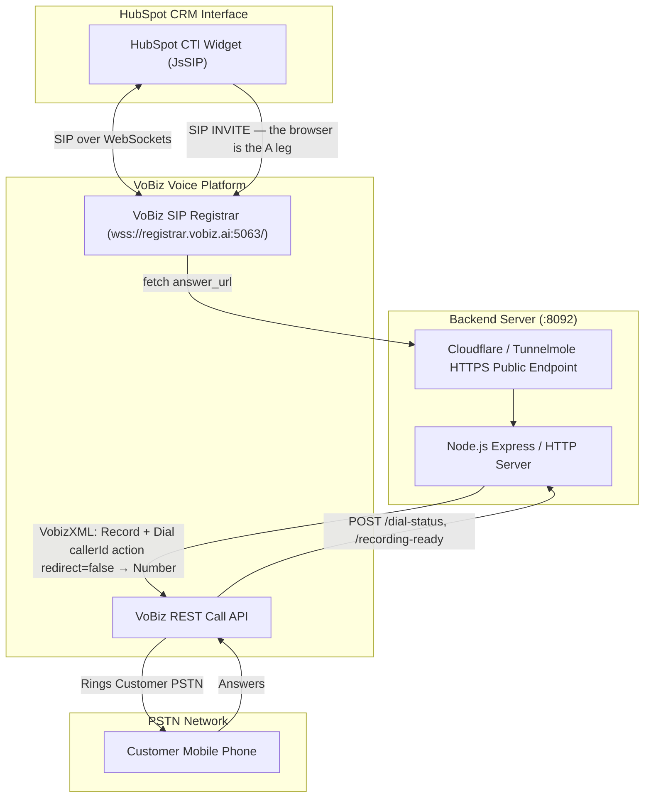

# Technical Architecture — VoBiz HubSpot Integration

This document describes the high-level architecture, communication protocols, and sequence flows for the **VoBiz Calling Integration for HubSpot CRM**.

---

## High-Level Architecture Components

---

## Core Operational Phases

### 1. Agent registration
The widget fetches its SIP identity from `GET /agent/{agentId}` — which the
backend serves **only to a logged-in agent** — and registers with
`wss://registrar.vobiz.ai:5063/` using `session_timers: false`, a space-free
`user_agent`, and STUN.

### 2. Outbound — the browser originates
The agent dials. **The widget sends the INVITE itself.** Vobiz fetches the
answer URL of the application the SIP endpoint is bound to, and the backend
returns `<Record recordSession>` followed by
`<Dial callerId … action … redirect="false"><Number>`.

`action` and `redirect="false"` are both required: without them Vobiz re-fetches
the answer URL when `<Dial>` ends and re-executes the document, so one call
dials the customer repeatedly.

### 3. Inbound — `<Dial><User>`
A PSTN caller reaches the DID attached to the application. `From` is a plain
number rather than a `sip:` URI, so the backend answers `<Dial><User>` naming
the registered endpoint, and the widget auto-answers.

`callerId` is mandatory here. Omit it and Vobiz derives it from the A leg —
the *caller's* number, which the account does not own — so B-leg creation is
refused silently and the browser never rings.

### 4. Post-Call Engagement & CDR Logging
- Upon call termination, duration, timestamps, and call details are logged via `cti.callCompleted()`.
- HubSpot automatically attaches the call log engagement to the active contact record.
